# Technical Architecture

This document outlines the design decisions and class relationships that enable OllamaTaskCreator's distributed, local-first operation.

## Architectural Rationale

The project follows a **Decoupled Engine-Hub** pattern to solve specific hardware constraints:
1.  **Distributed Compute**: LLMs require significant GPU resources, while a task dashboard should be "always on" but low-power. By decoupling the **Orchestrator** (Engine) from the **Web App** (Hub), we allow the AI to run on a workstation while the UI stays live on a Raspberry Pi.
2.  **Robust Communication**: We use **ZeroMQ (ZMQ)** and **Protocol Buffers (Protobuf)** instead of REST for internal component sync. This provides:
    -   **Asynchronous Heartbeats**: The Webapp knows if the engine is alive without polling.
    -   **Schema Safety**: Protobuf ensures both components agree on exactly what a "Task" or "Command" looks like.
3.  **Semantic Intelligence**: Unlike simple keyword matching, we use **Vector Embeddings** (`nomic-embed-text`) to identify duplicates. This allows the system to recognize that "Finish the report" and "Complete the quarterly draft" are semantically the same.

## Class Diagram

```mermaid
classDiagram
    class TaskPriority {
        <<Enumeration>>
        LOW
        MEDIUM
        HIGH
    }
    class TaskStatus {
        <<Enumeration>>
        TODO
        DOING
        DONE
    }
    class Task {
        +str name
        +str description
        +TaskPriority priority
        +TaskStatus status
        +str deadline
        +str scheduled
        +List~str~ tags
        +str id
        +to_dict()
        +from_dict()
    }
    class OrchestratorCommand {
        +CommandType type
        +str vault_path
    }
    class OrchestratorStatus {
        +bool is_alive
        +StatusType current_status
    }

    Task --> TaskPriority
    Task --> TaskStatus

    namespace WebApp_RaspberryPi {
        class BaseVaultManager {
            <<Abstract>>
            +create_vault()*
            +delete_vault()*
            +list_vaults()*
            +list_notes()*
            +create_note()*
            +retrieve_note()*
            +update_note()*
            +delete_note()*
            +get_tasks()*
            +upsert_task()*
            +delete_task()*
        }
        class LocalVaultManager {
            +Path base_dir
            +Path tracking_file
            +List tracked_vaults
            +create_vault()
            +list_vaults()
            +list_notes()
            +get_tasks()
            +upsert_task()
        }
        class WebappCommsClient {
            +str command_url
            +str status_url
            +Dict state
            +start_listening()
            +stop_listening()
            +send_generate_tasks()
            +get_status()
        }
        class VaultRequest {
            +str vault_path
        }
        class NoteRequest {
            +str vault_path
            +str content
        }
        class NoteCreateRequest {
            +str vault_path
            +str filename
            +str content
        }
    }

    namespace Orchestrator_PC {
        class MainOrchestrator {
            +OllamaWrapper ollama
            +TaskDeduplicator deduplicator
            +WebappTaskTarget task_target
            +OrchestratorCommsServer comms
            +run()
            -_process_vault()
        }
        class OrchestratorCommsServer {
            +str command_url
            +str status_url
            +bool is_processing
            +start()
            +stop()
            +send_connected()
            +send_disconnect()
            +register_command_handler()
        }
        class BaseNotesSource {
            <<Abstract>>
            +listAllFiles()*
            +retrieveContentFromFile()*
        }
        class WebappNotesSource {
            +str base_url
            +str vault_path
            +listAllFiles()
            +retrieveContentFromFile()
        }
        class BaseTaskTarget {
            <<Abstract>>
            +test_connection()*
            +create_task()*
            +fetch_tasks()*
        }
        class WebappTaskTarget {
            +str base_url
            +test_connection()
            +create_task()
            +fetch_tasks()
        }
        class OllamaWrapper {
            +str modelName
            +isRunning()
            +initModel()
            +getEmbedding()
            +generateTasksFromNotes()
        }
        class TaskDeduplicator {
            +OllamaWrapper ollama
            +List existing_cache
            +prepare_existing_tasks()
            +find_duplicate()
        }
    }

    LocalVaultManager --|> BaseVaultManager : implements
    WebappNotesSource --|> BaseNotesSource : implements
    WebappTaskTarget --|> BaseTaskTarget : implements

    WebappCommsClient ..> OrchestratorCommand : ZMQ PUSH
    OrchestratorCommsServer ..> OrchestratorStatus : ZMQ PUSH
    OrchestratorCommsServer ..> OrchestratorCommand : ZMQ PULL

    MainOrchestrator --> OrchestratorCommsServer : manages
    MainOrchestrator --> WebappNotesSource : reads notes
    MainOrchestrator --> OllamaWrapper : AI extraction
    MainOrchestrator --> TaskDeduplicator : semantic filter
    MainOrchestrator --> WebappTaskTarget : syncs tasks
    TaskDeduplicator --> OllamaWrapper : requests embeddings
    LocalVaultManager --> Task : persists
    WebappTaskTarget --> Task : creates
```

## Communication Flow

1.  **Web App** triggers a `GENERATE_TASKS` command via ZMQ PUSH.
2.  **Orchestrator** receives the command via `OrchestratorCommsServer` and switches status to `PROCESSING`.
3.  **Orchestrator** (via `WebappNotesSource`) fetches notes content from the **Web App** REST API.
4.  **OllamaWrapper** processes the text into a structured JSON task list using `llama3.1:8b`.
5.  **TaskDeduplicator** generates embeddings via `nomic-embed-text` and filters duplicates using cosine similarity.
6.  New tasks are pushed to the **Web App** via `WebappTaskTarget` REST calls.
7.  **OrchestratorCommsServer** continuously sends heartbeat status updates back to `WebappCommsClient`.
